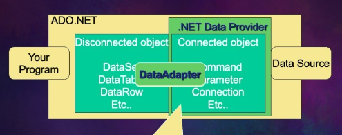
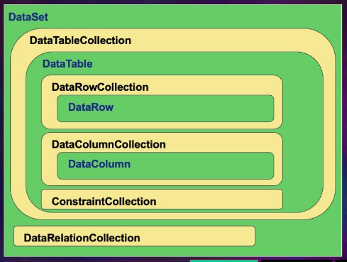
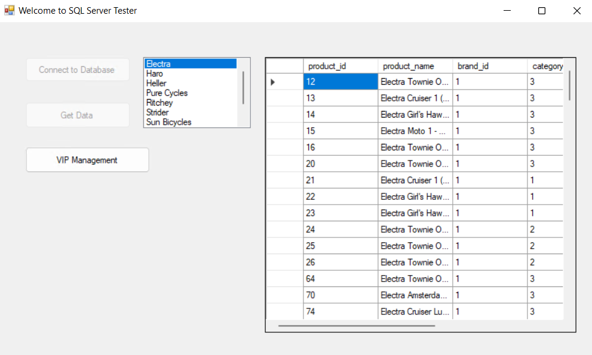
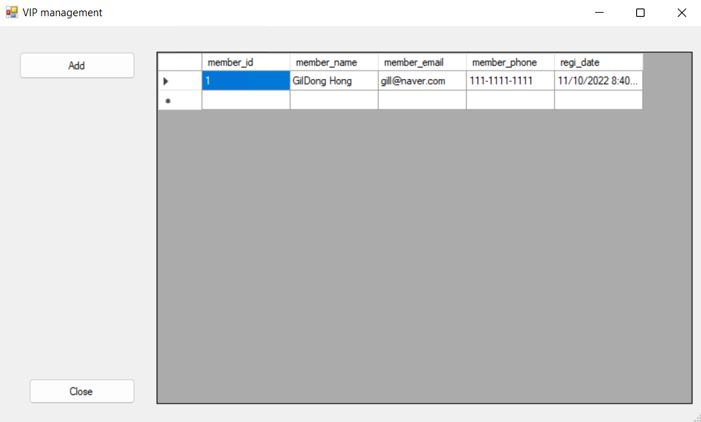
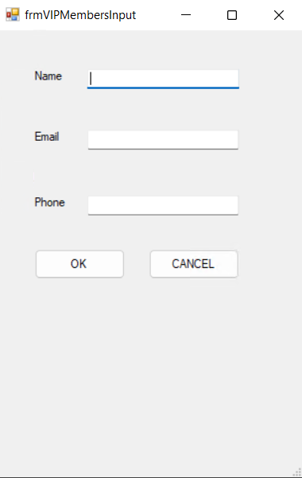

# Day27. Azure. ADO.NET & CRUD
## 1. ADO.NET
### 1.1 ADO.NET

    1) Data Source : Oracle, MS SQL, MySQL, PostgreSQL
    2) .NET Data Provider: Database 연결, Source간의 차이 해결
    3) ADO.NET : 개발환경(App)

    - Data Source는 Azure SQL Server을 사용
    - SQL DataAdapter을 통해서 연결
   
### 1.2. 개발환경 구축하기 (기본 setting)

    [1] Azure SQL (Database) 생성
    [2] Windows 2011 (VM) 환경 생성
    [3] Windows 2011 VM에 접속 후 "Visual Studio 2022 Community Edition" 다운로드
    [4] Windows 2011 VM에 접속 후 "Azure Data Studio" 다운로드 
    [5] Azure Data Studio 실행 후 Database와 연결 
    [6] Download sample query "https://www.sqlservertutorial.net/wp-content/uploads/SQL-Server-Sample-Database.zip"
    [7] Azure Data Studio >> "+ Add query" >> Sample query에서 Create, Load file을 실행 후 table을 생성하고 data를 load함 
    [8] Visual Studio 2022 >> 'Create Project' >> C#, Windows, Console >> 'Console App(.NET Framework)' 선택 
    [9] Visual Studio 2022 >> 'Create Project' >> C#, Windows, Desktop >> 'Windows Form App(.NET Framework)' 선택 

### 1.3. C# 결과
1) Weclome to SQL Server Tester 
- Database와 연결하여 Table의 정보를 Grid창에 출력
- "VIP Management" 버튼 클릭 시 VIP Management form으로 이동  

2) VIP Management
- Add 클릭 시 VIP Management Input form으로 이동
- Databse와 연결하여 VIP 관련 정보를 정보를 업데이트하여 Grid창에 출력 

3) frmVIPMemberInput
- Name, Email, Phone을 사용자에게 입력받음 
- OK 버튼 클릭 시 database에 입력된 정보 저장 

