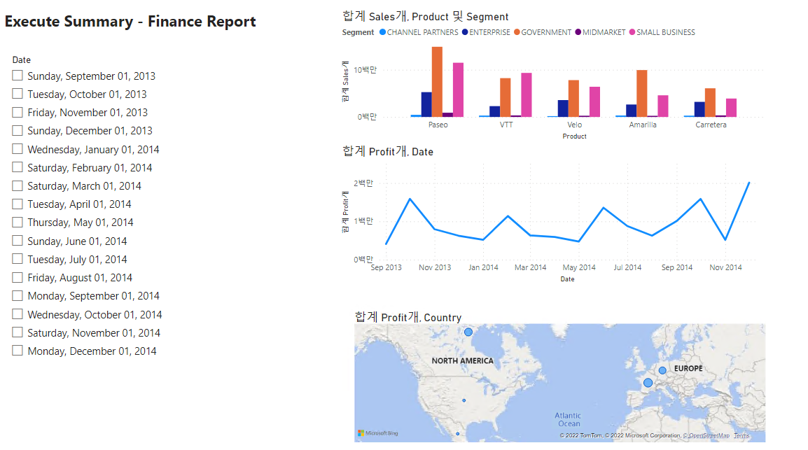

# Day32. Microsoft Certification: DP 900
## 1.  DP 900 모의고사
### 내용은 SECRET !!!
#### 나만의 One Note에 작성

## 2. Power BI 
### 2.1. Power BI를 위한 환경 구축하기
    1) Power BI 설치하기
        [1] 먼저 Windows 11 가상환경 만들기
        [2] 접속 후 Edge를 실행하여 "power bi desktop download" 검색
        [3] Power BI Desktop 다운로드 후 실행

    2) Data 업로드
        [1] 샘플 데이터  >> 샘플데이터 로드 >> "Financials" >> 데이터 변환 (Transform data)
        [2] "Unit Sold" 형식 변경 >> 정수 변환,
            "Segment" 상단의 '변환' >> '서식(Format)' >> '대문자(Uppercase)',
            "Month Name" >> "Month" 이름 변경,
            "Product" 아래 화살표 >> 'Montana' 체크하여 제외 
            (오른쪽 '적용된 단계'란에서 진행했던 변경사항 확인 가능)
        [3] 윗 상단의 'Home' >> '적용 및 저장'하면 변경된 데이터 저장

    3) 새로운 table 생성하고 관계 생성
        [1] 오른쪽에서 '필드'에서 data확인 가능
        [2] 왼쪽의 항목
            1) 보고서(Report)
            2) 데이터(Data)
            3) 모델 : Table간의 관계도
        [3] 위의 "테이블 도구" >> "새 측정값"
        [40] 위의 수식란에 "Total Units Sold = SUM(financials[Units Sold])" 입력 >> 화살표 체크
        [5] "테이블" 툴로 이동 >> new table >> 새로운 수식 "Calendar = CALENDAR(DATE(2013,01,01), DATE(2014,12,31))" 입력 >> 화살표 체크
        [6] "모델" 툴로 이동 >> "홈"에서 "관계 관리" >> Calendar의 date -> financials의 date 연결

    4) 보고서 (Report) 작성
        [1] 보고서 툴로 이동 >> Home의 "텍스트 박스" 추가
        [2] 왼쪽 필드의 Financial의 'Profit'을 드래그 하여 추가
        [3] 왼쪽 필드의 Calendar의 'Date'을 드래그 하여 추가하여 그래프 표시가능
    
### 완성본

## 3. Chatbot
### 3.1. 기본 setting
    [1] 먼저 Visual Studio 2022 Community Edition Download
    [2] https://github.com/KoreaEva/Bot/blob/master/Book/Samples/Chapter%203/GreatWall_Start.zip 다운로드
    [3] 압축해제 후 GreatWall 파일 열기 >> Greatwall >> Dialogs >> RootDialog.cs 파일 열고 실행 >> "SimpleEchoBot 웹사이트" 뜨면 성공
    [4] Emulator 다운로드 : 웹 키고 bot framework emulator download 검색 ("https://dev.botframework.com/") >> 상단의 'emulator' >> 'Github releases' 클릭 >> windows 버전 download >> 설치 >> 실행
    [5] File >> New Bot Configuration >> Endpoint에 위의 실행된 사이트 주소 + '/api/messages' 입력 >> connect & save
    [6] 오른쪽 아래에 "POST 202" 메세지 뜨면 성공 !!!

### 3.2. chatbot 수정하기
    https://github.com/KoreaEva/Bot/tree/master/HOL/20190629%20Chatbot%20HOL 참고하여 진행할 것

