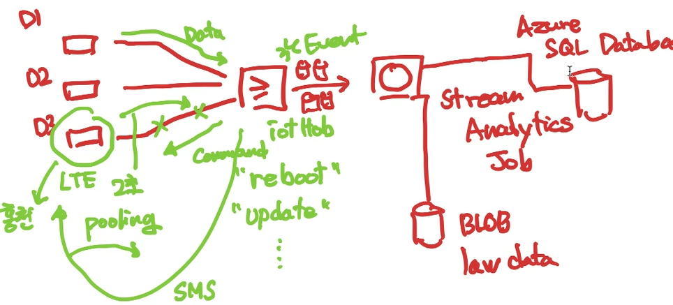

# Day26. Azure. IoT Hub & Stream Analytics Job & MS SQL Database
## 1. IoT Hub
### 1.1 Azure IoT Explorer 사용하기 
    1) IoT Hub 연결 하기
        [1] https://github.com/Azure/azure-iot-explorer/releases 
        >> Version 0.15.1 >> Azure.IoT.Explorer.Preview.0.15.1.msi 설치
        [2] Azure Portal >> IoT Hub >> "공유 엑세스 정책" >> iothubowner >> "기본 연결 문자열" 복사
        [3] Azure IoT Explorer 실행 >> Connection String 선택 >> + Add Connection >> [2] 에서 복사한 "기본연결 문자열" 붙여넣기 >> 성공

    2) IoT Hub와 message send & receive 하기
        [1] Send message ( SendEvent() ) : 
        DeviceID 선택 >> Device에 대한 정보 확인 가능 >> 왼쪽 tab의 'Telemetry' >> 'Start' >> 들어오는 message 확인 !!
        [2] Receive message ( ReceiveCommands() ) : 
        IoT Explorer >> 왼쪽 tab의 'Cloud-to-device message' >> 보낼 Message body 작성 >> 'Send message to device' >> 실행된 CMD 에서 message 확인 가능

## 2. Data Flow (Stream) 만들기 

- Stream Analytics Job >> Blob Storage >> Azure SQL Databse

### 2.1 Stream Analytics Job 만들기
    [1] 리소스 만들기
    [2] 'Stream Analytics Job' 검색 >> create
    [3] 기본 설정 >> create >> 리소스로 이동

### 2.2 Stream Analytics Job 연결하기
    [1] Input 만들기:
    왼쪽 tab의 Job topology(작업 토폴로지) >> input(입력) >> + Add stream input (스트림 입력 추가) >> "IoT hub" 선택 >> Alias(별칭), 해당 IoT Hub 설정 >> Save (저장) 
    [2] Output 만들기:
    왼쪽 tab의 Job topology >> output(출력) >> + 추가 >> "Blob Storage/ADLS Gen2" 선택 >> Alias(별칭), 해당 Storage Account, container, 인증 모드(Connection String) 설정
    [3] Input <-> Output 연결하기
    왼쪽 tab의 Job topology(작업 토폴로지) >> Query >> Input, Ouput 설정 >> Query 실행 >> Query 저장
    [4] Azure Portal >> Stream >> Overview(개요) >> Start(시작) >> 설정 >> Start
    [5] Flow 확인하기
    Azure Portal >> Storage >> Blob service >> weatherdata >> 일정시간 후 파일이 생성한 것을 확인 가능
    
 

## 3. Database
### 3.1. Database 만들기
    [1] 리소스 만들기
    [2] 'SQL Server' (파란색 SasS, 빨간색 IaaS) 검색 >> 'Azure SQL' >> 'SQL Database (Single DB) >> Create
    [3] <기본> 
        이름 , DB이름, Server(새로 만들기) -> 인증방법 (모두 사용), AD 관리자 설정
    <네트워크> 
        연결방법(Public/Private) >> Public 선택 >> Default 
    [4] crate >> 리소스로 이동
    [5] 상단의 "Set server firewall" (서버 방화벽 설정) >> 방화벽 규칙 >> 클라이언트 추가 >> 설정에 따라 범위 허용 가능

### 3.2. Widnows 가상환경에서 Azure Data Studio 설치 & 실행하기
    [1] https://learn.microsoft.com/en-us/sql/azure-data-studio/download-azure-data-studio?view=sql-server-ver16 로 들어가서 설치파일 다운로드 >> Download
    [2] Azure Data Studio 실행 >> "Create Connection"
    [3] Server 이름:  Azue Portal >> SQLDatabase >> Overview >> "Server Name" 복붙
        Authentication type: SQL Login >> 아이디, 비밀번호 입력 >> Connect >> 성공 !!

## 4. Data
- Data 종류:
    1) 구조화: xlsv, csv, yaml 
    2) 반구조화: 
    3) 비구조화: 이미지 동영상

- Data 처리방법: 
    1) OLTP (온라인 Transaction 거래 처리) : 데이터는 한번의 transaction으로 저장 (한번에 묶어서 처리함 -> Locking -> BUT "Dead Lock" 초래 가능 !!)
    2) OLAP (온라인 Analytics 분석 처리)   : 데이터는 큐브에 주기적으로 로드, 집계, 저장 (필요한 datat를 뽑아 -> Data Cube)

- 트랙젝션 워크로드 (영-원-일-격)
    1) 원자성 : 완전히 성공 / 실패하는 단일단위
    2) 일괄성 : 유효 상태 간에만 전환 (다른 사람이 transaction하는 순간 locking)
    3) 격리   : 동시에 실행해도 동일 상태로 유지 (동시에 해도 충돌 X, isolate)
    4) 영속성 : 커밋된(끝난) transcation은 커밋된 상태로 저장

- 분석 워크로드 : 데이터 분석 및 의사 결정에 사용
    1) 요약
    2) 추세
    3) 비즈니스 정보 (BI) : Tableau -> 데이터 시각화

- Data 처리 : 원시 데이터를 의미있는 정보로 전환
    1) 일괄 처리 (Batch Processing) :  일정 이상 데이터가 모이면 한번에 처리
    2) 스트림 처리 (Stream Procesisng) : 새 데이터가 도착하면 처리

- Data의 역할
    1) Database 관리자 : Database 자체를 관리 (보안, 백업, 사용자 access, 성능 모니터링)
    2) Data 엔지니어 : Data를 관리 (pipeline, 수집, 분석용 데이터, 분석처리를 위한 준비)
    3) Data 분석가 : Data를 분석 (상관관계, 시각적, 데이터 모델링, 데이터 결합)

    1) Database 관리자
        - Azure Data Studio : Windows, macOS, Linux 실행
        - SQL Server Management Studio (SSMS) : Windows에서 실행, 포괄적인 관리도구 
        - Azure Portal / CLI