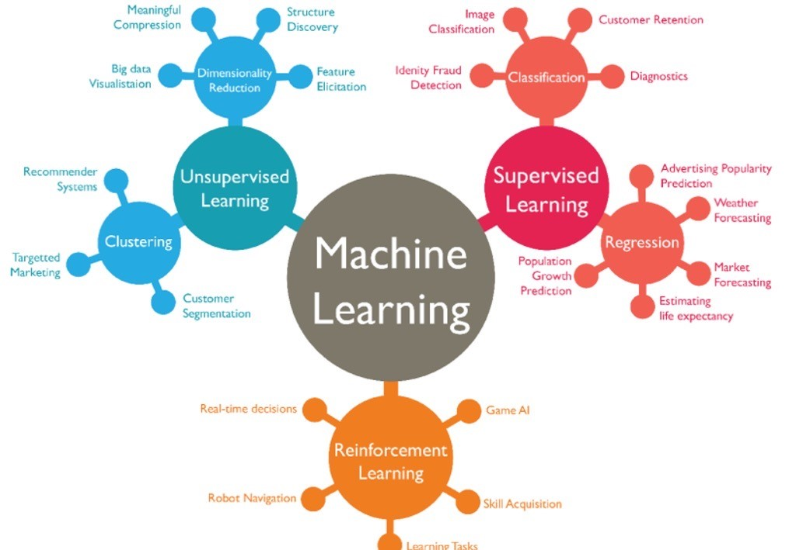
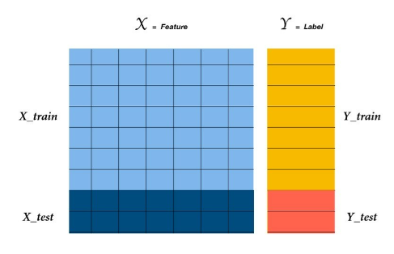
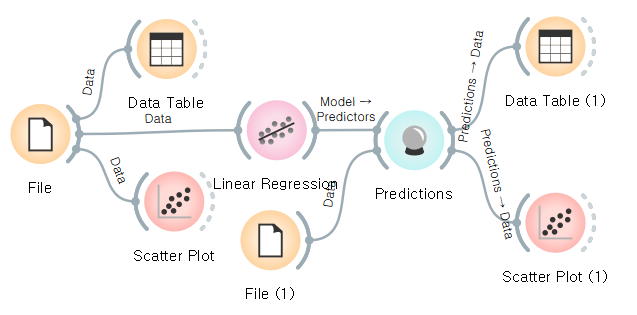
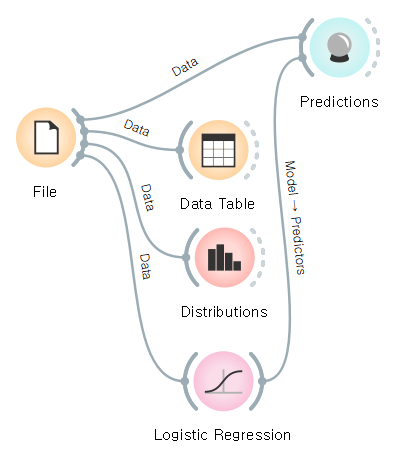
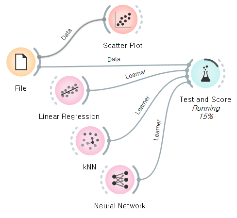
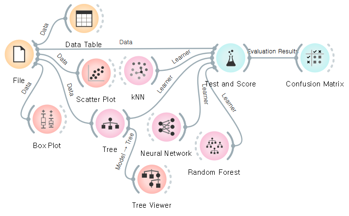
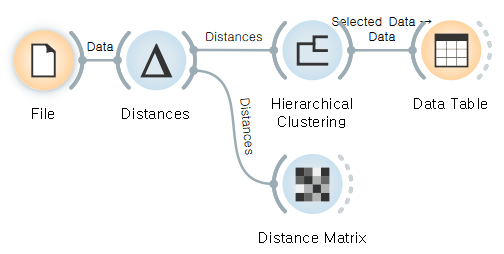

# Day16. Machine Learning & Data & Orange Data Mining

## 1. Machine Learning(기계학습)
### - Macine Learning이란 ?
    - 학습과 개선을 위해 명시적으로 컴퓨터를 프로그래밍하는 대신, 컴퓨터가 데이터로 학습하고 경험을 통해 개선하도록 훈련하는 데 중점을 둔다
    - 패턴과 상관관계를 찾고 분석을 토대로 최적의 의사결정과 예측을 수행하도록 훈련한다.
    - Computer Science : 사람이 찾아서 기계한테 알려줌
    - Machine Learning : 데이터를 많이주고 기계한테 직접 찾게함

### - Macine Learning 분야
    1. Supervised Learning (지도학습): 문제(Feature), 정답(label, target)을 제공
        ex) Regression(측정), Forecast, Classification(분류)
    2. Unsupervised Learning (비지도학습): 문제(Feature)만 제공 // 패턴&구조 발견, 그룹화
        ex) Anomaly(변칙 검색), Clustering(군집화)
    3. Reinforcement Learning (강화학습): Reward(보상) 제공, 인과관계가 중요, 게임에 많이 사용(알파고), 로봇

</img>

#### -​ Scikit-learn이란 ?  
    - python을 대표하는 머신러닝 라이브러리

## 2. Data
### - Steps
    1. Understand the Business Domain
        -> 비즈니스 도메인 이해
    2. Understand the Business Problem
        -> 비즈니스에 실제로 필요한 문제점 확인
    3. What is the Right Data, Right Column and Right Algorithm
        -> 적합한 data, column, alogrithm을 준비
    4. Combine Knowledge with Machine Learning
        -> 지식을 기계학습과 접합

### - Data 분류
    1. Features(특징): 문제, 입력되는 정보
    2. Label(라벨): 정답, 예측을 하고자 하는 대상 항목
</img>

## 3. Orange3을 활용한 Data Mining (Only for today)
- 데이터에 대한 기본지식이 없이도 데이터 처리 및 시각화하고 머신러닝을 적용해 볼 수 있는 도구

### - 주요 기능
    1. Data: 데이터 입력, 필터링, 샘플링
    2. Visualization: Box plot, Histogram, Scattering etc...
    3. Evaluate: 모델평가를 위한 위젯 제공
    4. Unsupervised: 비지도학습을 위한 기능 제공

### -  Orange3를 이용한 Data 분석
#### 1. Regression

#### 1.1. pratice 1 (Custom Data)
</img>

    - Topic: y값 예측
    1) Feature : 근속 년차
    2) target : 연봉

#### 1.2. practice 2 (Titanic Data)
</img>

    - Topic: 타이타닉 생존자 여부
    1) Feature : status(등급), age(나이), sex(성)
    2) target : survived(생사여부)

#### 1.3. practice 3 (Housing Data)
</img>
    
    - Topic: 보스턴 집 값 예측
    1) Feature : crim(범죄율), rm(방의 수) 등 13개
    2) target : medv(주택 가격 중앙값)

### 2. Classification

#### 2.1. practice 4 (Iris Data)
</img>
    
    - Topic: 아이리스의 종류 구분
    1) Feature : sepal length(받침 너비) 등 4개
    2) target : setosa, versicolor, virginica (꽃의 종류 3가지)

### 3. Unsupervised Learning

#### 3.1. practice 5 (Iris Data)
</img>
    
    - Topic: 아이리스의 종류 구분
    1) Feature : sepal length(받침 너비) 등 4개
    2) target : setosa, versicolor, virginica (꽃으 종류 3가지)

