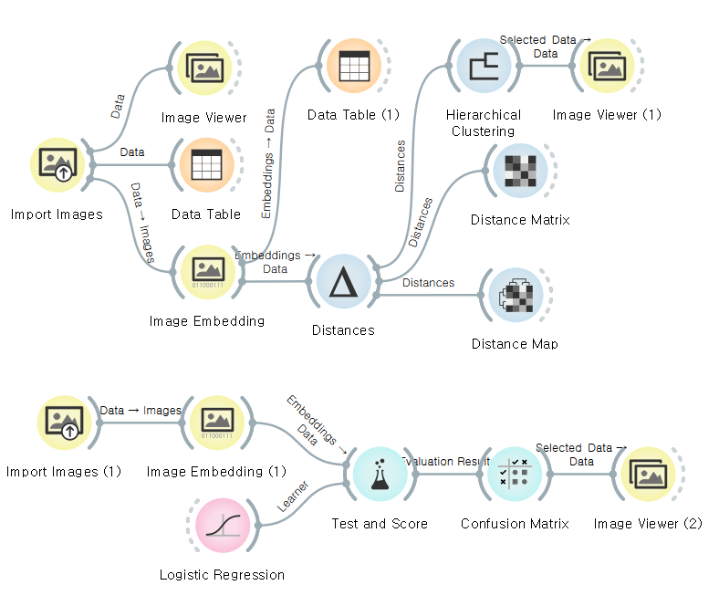
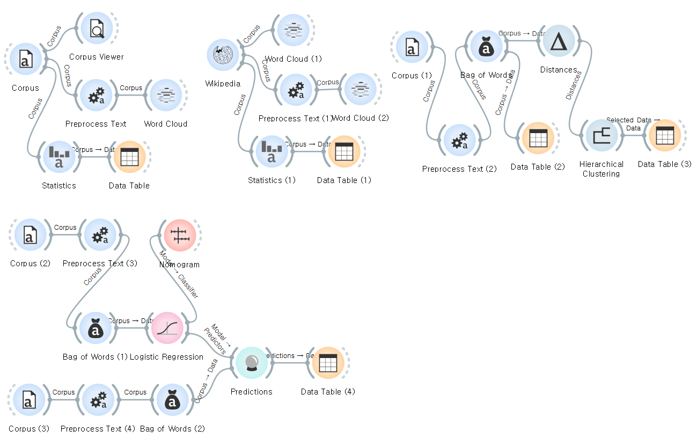

# Day17. ML. Orange Data Mining & Scikit Learn

### I. Orange3를 이용한 Image & Text Data 분석
#### 1. Image (Dog & Cat)
</img>

    - Topic: Classification on Dogs & Cats image data
    1) Feature : 강아지, 고양이 image 20장씩 총 40장 
    2) target : Classification (강아지&고양이)

#### 2. NLP (grim tales data & wikipedia)
</img>

    - Topic: NLP on wikipedia & grim tales data
    1) Data : 자연어 (tales, wikipedia) 
    2) Goal : NLP 분석 도구 활용

## II. Scikit Learn
- python을 대표하는 머신러닝 라이브러리

### - Scikit-learn Cheat Sheet 

    - 조건에 따라 구분할 수 있는 도표
        ex) category / quantity / labeling, 
            classification / clustering / regresiion / dimensionality reduction 

